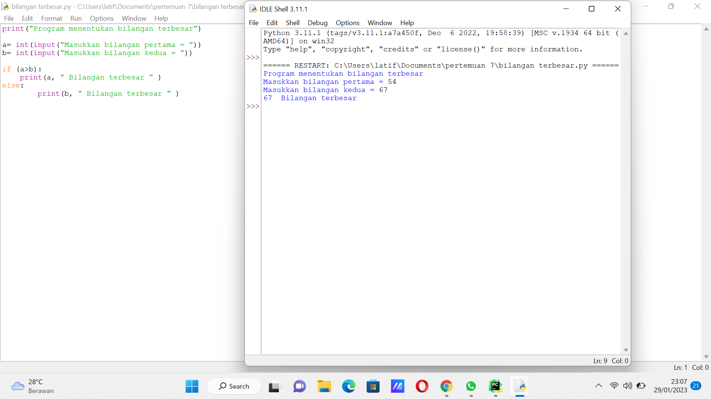
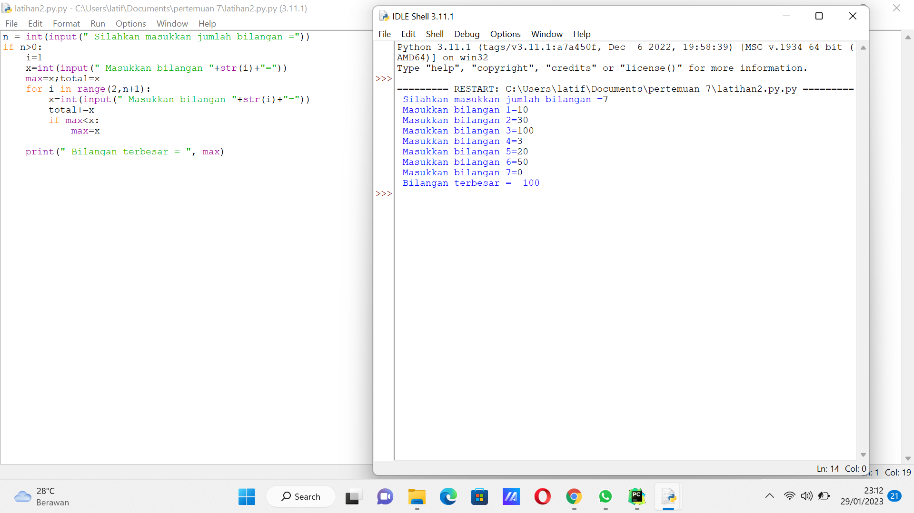
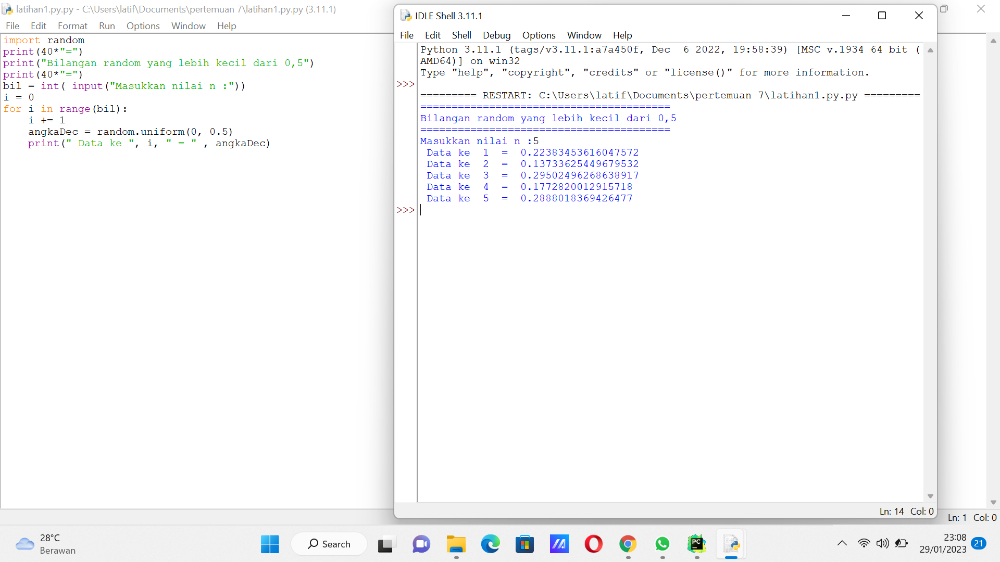
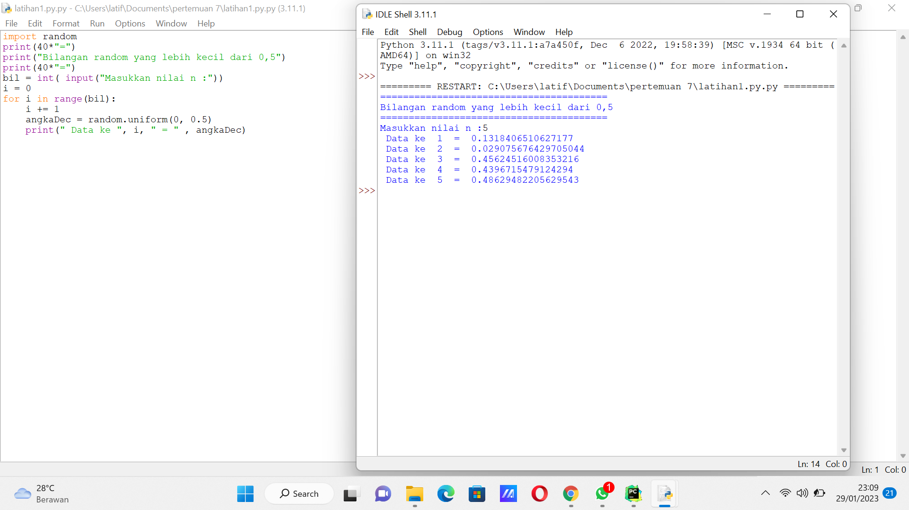
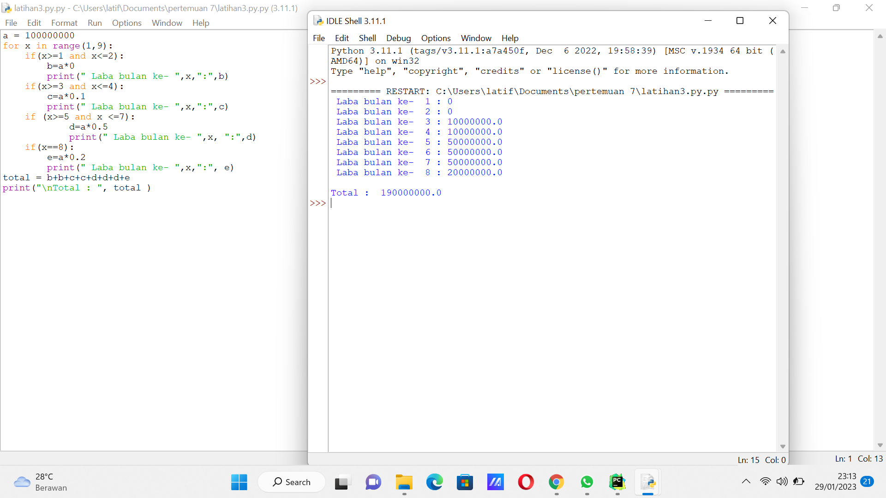

# labpy03
## Tugas bahasa pemrograman

1. Latihan 1 
membuat program sederhana menentukan bilangan terbesar dari dua buah input bilangan dengan menggunakan 'if statement'
2. Latihan 2 
membuat program untuk mengurutkan data dari yang terkecil berdasarkan input data
3. Latihan 3 
membuat program perulangan bertingkat dengan menampilkan 10 baris dan 10 kolom
4. Latihan 4 
Menampilkan bilangan acak yang lebih kecil dari 0.5 secara random
5. Latihan 5 
Menampilkan bilangan acak yang lebih kecil dari 0.5 secara random
6. Latihan 6 
Membuat program untuk menampilkan bilangan terbesar dari beberapa data yang diinputkan
7. Latihan 7 tugas praktikum 
Membuat program untuk menghitung laba seorang pengusaha selama 8 bulan 